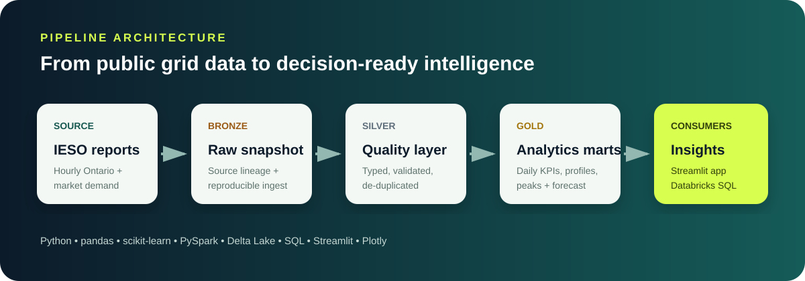
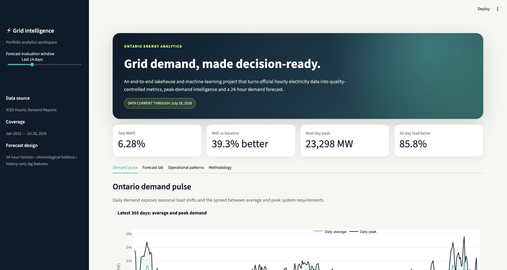
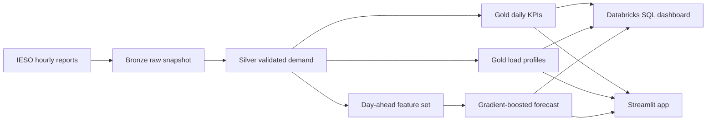

# Ontario Grid Demand Intelligence



An end-to-end analytics-engineering and machine-learning project that turns official Ontario electricity-demand reports into a tested Bronze/Silver/Gold pipeline, operational KPIs, a leakage-safe 24-hour forecast, Databricks tables and an interactive decision dashboard.

> **Portfolio focus:** data engineering + analytics + applied ML, grounded in an energy-system problem that connects directly to my mechanical-engineering background.



## Verified snapshot

The local pipeline was executed on **July 28, 2026** against current IESO reports.

| Evidence | Verified result |
|---|---:|
| Hourly observations | 40,056 |
| Data coverage | Jan 1, 2022 – Jul 28, 2026 |
| Missing demand values | 0 |
| Duplicate timestamps after de-duplication | 0 |
| Source-report gaps detected | 1 hour |
| Test period | Final 60 days (1,417 hours) |
| Forecast MAPE | **6.28%** |
| Forecast MAE | **1,127 MW** |
| Forecast R² | **0.755** |
| MAE improvement over same-hour-last-week baseline | **39.3%** |

Exact machine-readable results live in [`data/gold/model_metrics.json`](data/gold/model_metrics.json) and [`data/gold/data_quality_report.json`](data/gold/data_quality_report.json).

## What this project demonstrates

- Reproducible ingestion from official IESO annual and current reports
- Source lineage and Bronze/Silver/Gold data modelling
- Schema, null, duplicate and hourly-continuity checks
- Leakage-safe calendar, lag and rolling-window features
- Chronological train/validation/test evaluation
- An honest seasonal-naive benchmark
- Empirical 90% prediction intervals calibrated on validation residuals
- Dashboard-ready Gold tables and Databricks SQL
- A polished Streamlit application for executive and operational exploration
- Automated unit tests with a CI-ready workflow kept in the local deliverable

## Architecture



## Forecast design

The model predicts each of the next 24 hourly demand intervals using only information available at least one day earlier:

- 24-hour, 48-hour and 168-hour demand lags
- 24-hour and 168-hour rolling means shifted by 24 hours
- Hour, weekday, month, day-of-year and weekend features
- Cyclical encodings for hour and weekday

The final 60 days are never used for training. The preceding 60 days calibrate the prediction interval. A seasonal-naive forecast using the same hour one week earlier provides the benchmark. See [`MODEL_CARD.md`](MODEL_CARD.md) for limitations and responsible-use guidance.

## Run locally

```bash
python -m venv .venv
source .venv/bin/activate
pip install -r requirements.txt
PYTHONPATH=src python run_pipeline.py
streamlit run app.py
```

Run the automated checks:

```bash
PYTHONPATH=src pytest -q
```

## Run in Databricks

Import [`notebooks/Ontario_Grid_Demand_Intelligence_Databricks.ipynb`](notebooks/Ontario_Grid_Demand_Intelligence_Databricks.ipynb), attach a cluster and run all cells. The notebook creates:

- `portfolio.ontario_grid_bronze`
- `portfolio.ontario_grid_silver`
- `portfolio.ontario_grid_gold_daily`
- `portfolio.ontario_grid_gold_hourly_profile`
- `portfolio.ontario_grid_gold_peak_hours`
- `portfolio.ontario_grid_gold_forecast`

Use [`sql/dashboard_queries.sql`](sql/dashboard_queries.sql) to build the Databricks SQL dashboard.

## Repository map

```text
app.py                       Interactive operations and forecast dashboard
run_pipeline.py              One-command local pipeline
src/grid_intelligence/       Ingestion, quality, features, model and Gold marts
notebooks/                   Uploadable Databricks notebook
sql/                         Dashboard-ready SQL queries
data/gold/                   Small derived analytics and evaluation outputs
artifacts/                   Trained model and feature contract
tests/                       Unit tests for parsing, quality, features and metrics
docs/                        Architecture and application preview
```

## Data and evidence boundaries

The source is the IESO Hourly Demand Report. Raw and cleaned row-level snapshots are generated locally and excluded from version control. Small derived Gold outputs are included for reproducibility and application review. Source terms and attribution are documented in [`DATA_SOURCES.md`](DATA_SOURCES.md).

The metrics above were reproduced locally. The Databricks notebook is structurally validated but its tables and metrics should be treated as workspace-verified only after all cells run successfully in Databricks.

## Technology

Python · pandas · scikit-learn · PySpark · Delta Lake · SQL · Databricks · Streamlit · Plotly · pytest

## Author

**Hazim Ali** — Mechanical Engineer and Artificial Intelligence: Development and Applications student at Sheridan College, seeking Winter 2027 co-op opportunities in data analytics, business intelligence, data engineering, data science and AI automation.

Code is released under the [MIT License](LICENSE). IESO content remains subject to the source terms described in [`DATA_SOURCES.md`](DATA_SOURCES.md).
